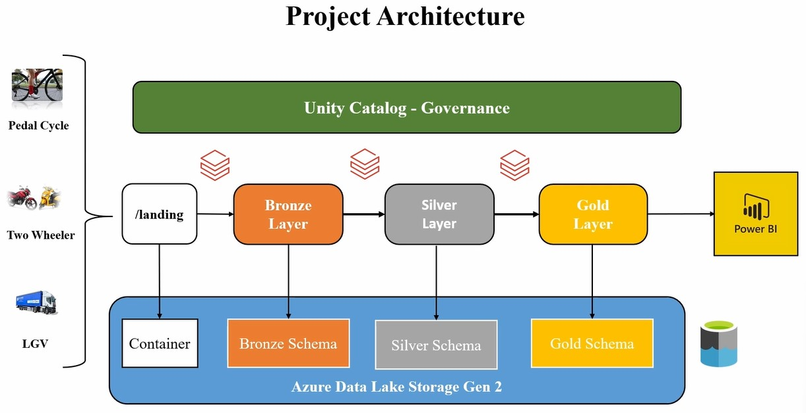
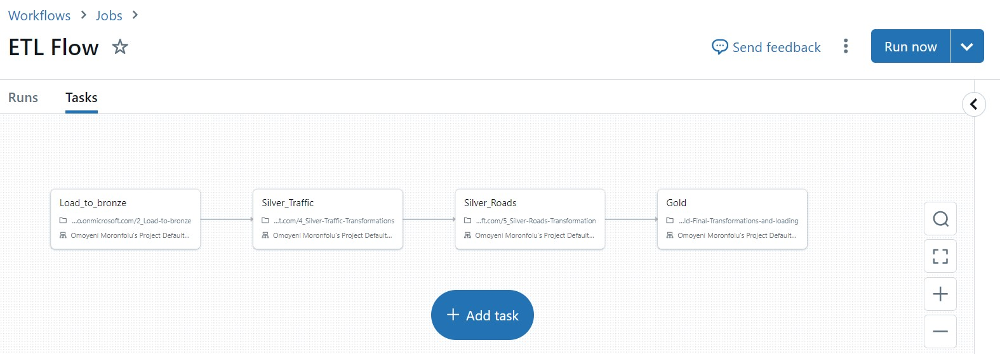
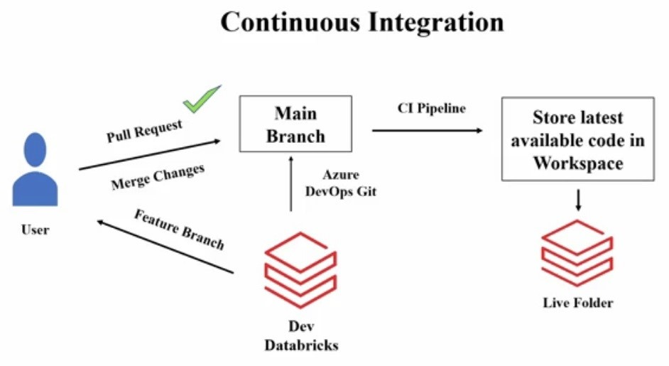
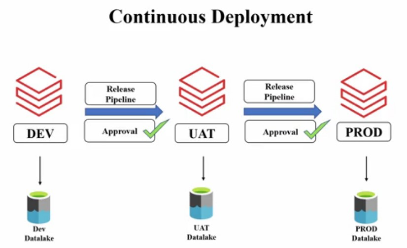
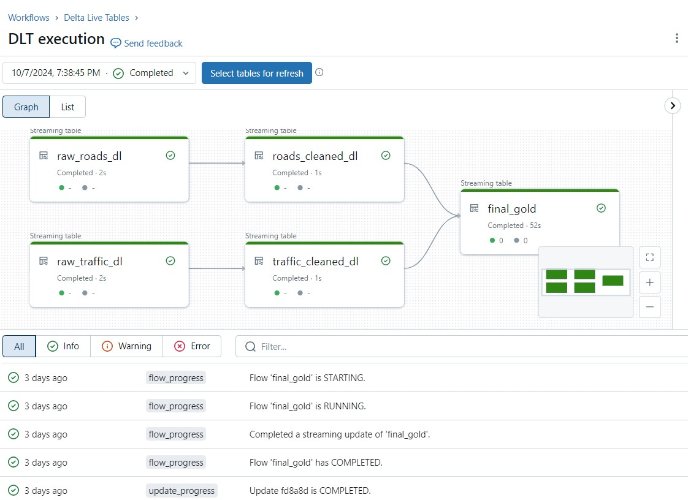

# Azure Databricks Streaming Project

## Overview

This project illustrates a Lakehouse data engineering pipeline utilizing Azure Databricks with batch processing through Spark Structured Streaming. It leverages the Databricks Unity Catalog and follows a medallion architecture, transitioning data from the landing layer through the bronze, silver, and gold layers. The final gold layer data is utilized for reporting in Power BI.

The project employs Azure DevOps for CI/CD processes, facilitating seamless deployments across environments. 

Additionally, it includes a Delta Live Tables (DLT) project with DLT pipeline and workflow.

 

<i>Below is the project architecture diagram outlining system's components and data flow:</i>

 

 

## Project Structure

The project follows a medallion architecture consisting of four key layers:

- **landing layer:** Raw data upload storage
- **bronze layer:** Raw data storage
- **silver layer:** Processed data
- **gold layer:** Data ready for analytics and reporting

 

## Workflow

1. **Data Ingestion:**
   - Data for different vehicle types and road categories in csv format is manually uploaded in batch mode to the **landing layer**, which is an Azure Data Lake container.
   - Incremental ingestion from the landing layer to the **bronze layer** is achieved using **Autoloader**.

2. **Data Transformation:**
   - Transformations are applied to data in the **bronze layer**.
   - The processed data is stored in the **silver layer** for further refinement.
   - Additional transformations are applied in the **gold layer**, preparing the data for reporting.

    
   <i>Below is the workflow diagram of the project:</i>
    

   

3. **Reporting:**
   - Data in the Gold Layer is utilized for creating reports in **Power BI**.

 

## Continuous Integration and Deployment

The project employs **Azure DevOps** to implement Continuous Integration and Continuous Deployment (CI/CD) processes. Key features include:

- Automated deployment of notebooks and essential files to the 'dev_catalog' of the Azure Databricks workspace and live folder.
- Automated deployment of notebooks and essential files to the 'uat_catalog' of the Azure Databricks workspace and live folder occurs upon approval to ensure quality control.

<i>Diagram below illustrates the CI/CD concept implemented in the project</i>

 

<table style="width: 100%; border-collapse: collapse;">
  <tr>
    <td style="width: 40%; padding: 10px; vertical-align: top; border-right: 1px solid #ddd;">
      
    </td>
    <td style="width: 40%; padding: 10px; vertical-align: top;">
      
    </td>
  </tr>
</table>

 

## Delta Live Table  

The project also contains a mini-project utilizing **Delta Live Tables** workflow execution as data flows from the landing layer to the bronze and through the silver layer to the gold layer.

 

<i>See below workflow execution of the Delta Live tables</i>

 

## Technologies Used

- **Azure Databricks**
- **Spark Streaming**
- **Unity Catalog**
- **Azure Data Lake Storage**
- **Autoloader**
- **PowerBI Desktop**
- **Azure DevOps** 
