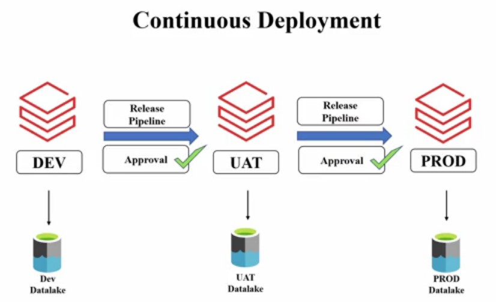

# Azure Databricks Streaming Project

## Overview

This project highlights Unity Catalog and medallion architecture within a Lakehouse data engineering pipeline that utilizes Azure Databricks and batch processing through Spark Structured Streaming. It transitions data from the landing layer through the bronze, silver, and gold layers, with the final gold layer data used for reporting in Power BI. For details on the source code files, refer to the [notebooks](./notebooks/) folder.

The project employs Azure DevOps for [CI/CD](./CICD/) processes, facilitating seamless deployments across environments. 

Additionally, it includes a [Delta Live Tables (DLT)](./DeltaLiveTables/) project with DLT pipeline and workflow.

 

<i>Below is the project architecture diagram outlining system's components and data flow:</i>

 

## Project Architecture Diagram

 

## Table of Contents

- [Medallion Layers](#medallion-layers)
- [Technologies](#technologies)
- [Data Ingestion](#data-ingestion)
- [Data Transformation](#data-transformation)
- [Reporting](#reporting)
- [Continuous Integration and Deployment](#continuous-integration-and-deployment)
- [Delta Live Table](#delta-live-table)

 

## Medallion Layers

The project utilizes a medallion architecture consisting of four layers:

- **landing layer:** Raw data upload storage
- **bronze layer:** Raw data storage
- **silver layer:** Processed data
- **gold layer:** Final processed data ready for analytics and reporting

 

## Technologies

- **Azure Databricks**
- **Spark Streaming**
- **Unity Catalog**
- **Azure Data Lake Storage**
- **Autoloader**
- **PowerBI Desktop**
- **Azure DevOps**

 

  [Back to Table of Contents](#table-of-contents) &nbsp; [Back to Top](#overview)

 

The project source code where the data ingestion and data transformations takes place can be found [here](./notebooks/)

 

## Data Ingestion
   - Data for different vehicle types and road categories in csv format is manually uploaded in batch mode to the **landing layer**, which is an Azure Data Lake container.
   - Incremental data ingestion as stream from the landing layer to the **bronze layer** is achieved using **Autoloader**.

 

  [Back to Table of Contents](#table-of-contents) &nbsp; [Back to Top](#overview)

## Data Transformations

### Transformations
Some of the transformations performed on data can be broadly categorized into data quality transformations and dataset-specific transformations. These include:
  - removing duplicates
  - replacing null values
  - aggregating data in some columns
  - adding, removing, and renaming columns

### Transformation Layers
  - Transformations are applied to data in the **bronze layer**, and the output of the transformation is saved in the **silver layer**.
  - Additional transformations, such as adding calculated columns and date columns, are applied to the data in the **silver layer**, and the output of this layer is stored in the **gold layer**.
  - The data in the **gold layer** is consumed within Power BI for analytics, reports, and dashboards.

   

  <i>Below is the workflow diagram of the project:</i>

   

  

 

  [Back to Table of Contents](#table-of-contents) &nbsp; [Back to Top](#overview)

 

## Reporting

Data in the Gold Layer is utilized for creating reports in Power BI. The Power BI file can be found [**here**](./Report/). 

 
  

 

## Continuous Integration and Deployment

The project employs **Azure DevOps** to implement Continuous Integration and Continuous Deployment ([CI/CD](./CICD/)) processes. Key features include:

- Automated deployment of notebooks and essential files to the 'dev_catalog' of the Azure Databricks workspace and live folder. For details refer to [Live](./CICD/Live/) folder.
- Automated deployment of notebooks and essential files to the 'uat_catalog' of the Azure Databricks workspace and live folder occurs upon approval to ensure quality control.

 

<i>Diagram below illustrates the CI/CD concept implemented in the project</i>

 

<table style="width: 100%; border-collapse: collapse;">
  <tr>
    <td style="width: 40%; padding: 10px; vertical-align: top; border-right: 1px solid #ddd;">
      
    </td>
    <td style="width: 40%; padding: 10px; vertical-align: top;">
      
    </td>
  </tr>
</table>

 

  [Back to Table of Contents](#table-of-contents) &nbsp; [Back to Top](#overview)

 

## Delta Live Table  

The project also contains a mini-project utilizing **Delta Live Tables** workflow execution as data flows from the landing layer to the bronze and through the silver layer to the gold layer. For details on the Delta Live Tables implementation, refer to [DLT](./DeltaLiveTables/DLT.sql)

 

<i>See below workflow execution of the Delta Live tables</i>

 

  [Back to Table of Contents](#table-of-contents) &nbsp; [Back to Top](#overview)

